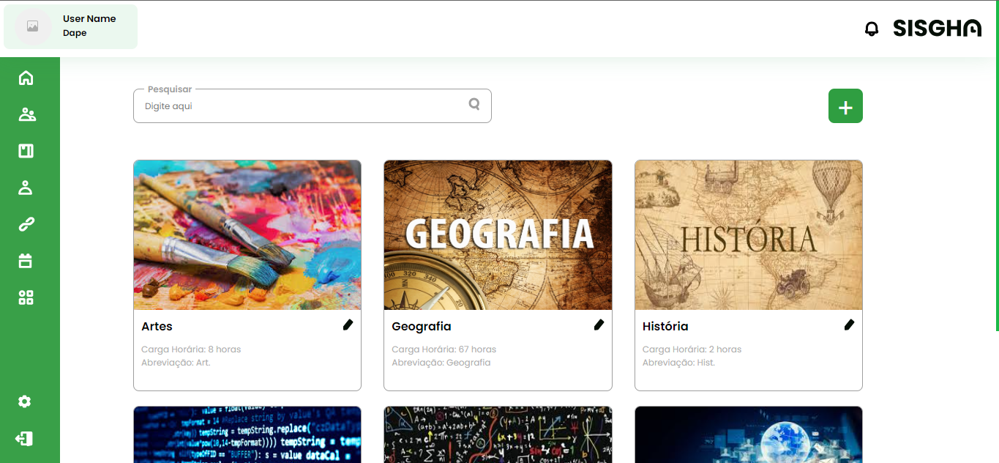
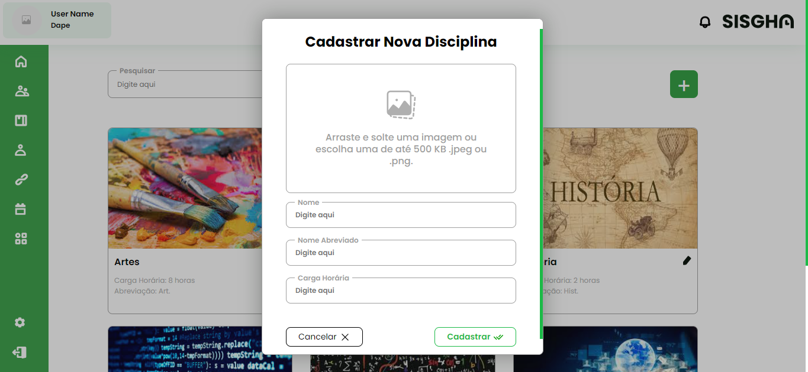

# Listagem de Disciplinas

Este projeto consiste na implementação de uma tela a partir de um protótipo do Figma e Web.

 Demonstração da tela

 Demonstração do modal

## Tabela de Conteúdos

- [Sobre](#-sobre)
- [Tecnologias Utilizadas](#-tecnologias-utilizadas)
- [Ferramentas Utilizadas](#-ferramentas-utilizada)

## 📄 Sobre

A tela foi desenvolvida com base no modelo "DAPE: Disciplinas: Listagem" do SISGHA, no Figma, adaptado ao modelo da Web, visando aplicar os conceitos de HTML, CSS e JavaScript anteriormente estudados.

## 👩🏻‍💻 Tecnologias Utilizadas

- **HTML**: Estrutura da página
- **CSS**: Estilização e layout
- **JavaScript**: Interatividade e manipulação de DOM

## 💻 Ferramentas utilizadas

- [Visual Studio Code](https://code.visualstudio.com/)
- [Figma](https://www.figma.com/)
- [Icon-icons](https://icon-icons.com/)